# Metamers of a vision-language model

Petr Karnakov, September 2026 · [code](https://github.com/pkarnakov/metamers)

What does an image need to contain
for a vision-language model to describe it with a given sentence?
Here, images are optimized from uniform gray
until [Qwen3.5-0.8B](https://huggingface.co/Qwen/Qwen3.5-0.8B),
asked to "Describe this image in one sentence.",
answers with exactly the prescribed text.
With a multigrid parameterization of the image,
noise during the optimization, and random perturbations of the parameters,
the images show the described objects
instead of the adversarial noise that plain gradient descent on pixels produces.

<a href="media/wine_perturb_1000.png">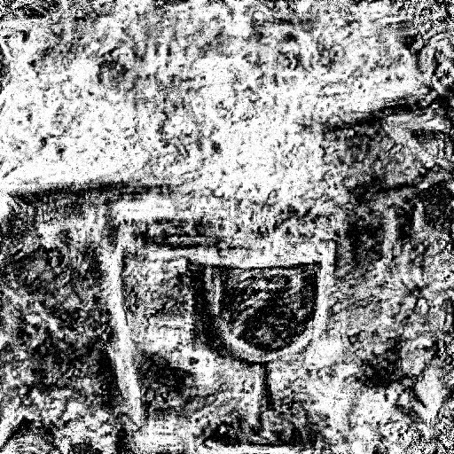</a><a href="media/schoolbus_perturb_1000.png">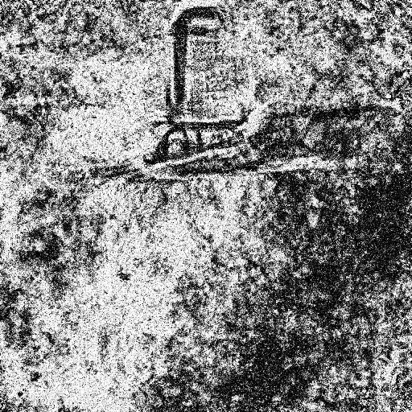</a><a href="media/cat_perturb_1000.png">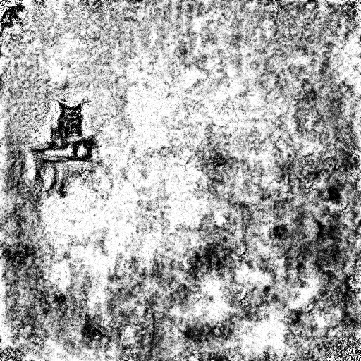</a><a href="media/cat_perturb_tv_1000.png">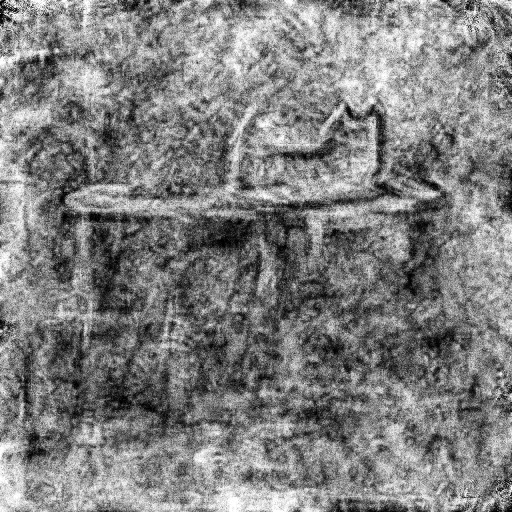</a>

Images for the targets
"A glass of wine on a table.",
"A school bus on a road.",
and "A cat sitting on a table." (the two right images, the rightmost with a smoothness penalty),
512×512 grayscale, 1000 steps each.
The first and the last give exactly the target, see the [examples](#examples).

The term follows the model metamers of
[Feather et al. (2019)](https://proceedings.neurips.cc/paper/2019/hash/ac27b77292582bc293a51055bfc994ee-Abstract.html),
stimuli that produce the same response in a model stage as a natural stimulus.
Here, the matched response is the generated text, the last possible stage.
The approach is related to feature visualization
([Olah et al., 2017](https://distill.pub/2017/feature-visualization/))
and DeepDream, but the objective is a whole sentence
rather than the activation of a unit.

## Method

**Loss.**
The prompt and the image are followed by the target tokens $y_1, \dots, y_n$
and the end-of-turn token,
and the loss is the teacher-forced cross-entropy from a single forward pass,

$$L(x) = -\frac{1}{n} \sum_{i=1}^{n} \log p(y_i \mid x, \text{prompt}, y_1, \dots, y_{i-1}).$$

The preprocessing of the model (resizing, normalization, patches)
is reimplemented differentiably and checked against the original processor.
The image is optimized with Adam using gradients with respect to the image.

**Success criterion.**
An image counts only if greedy generation gives exactly the target text
from the image saved as an 8-bit PNG and passed through the standard processor.
A low loss is not enough:
the model must produce the sentence itself, including where it stops,
without teacher forcing and without the noise used in the optimization.

**Multigrid parameterization.**
The image is $x = x_0 + u$ with the gray image $x_0$ and the perturbation
$$u = u_1 + T_1 (u_2 + T_2 (u_3 + \dots)),$$
a sum of components on grids coarsened twice per level,
from 512×512 to 2×2,
where $T_i$ is linear interpolation to the finer grid.
All levels are optimized together.
This decomposition comes from
[mODIL](https://doi.org/10.1140/epje/s10189-023-00313-7),
a method for solving inverse problems with PDEs,
where it accelerates the convergence of gradient-based optimization.
The image is kept within $[0, 1]$ through a sine,
$x = 0.5 + 0.5 \sin(\varphi_0 + 2u)$,
which has no flat regions, unlike clamping or a sigmoid.

**Noise.**
The loss is evaluated on $x + \sigma \xi$ with Gaussian noise $\xi$, new at every step,
so that the image cannot rely on the exact values of individual pixels.
The noise can itself be multigrid, with blobs of all sizes,
and the parameters can be perturbed after every step.

**Why multigrid helps.**
Let $s$ be the ratio of the consistent part of the gradient in a pixel
to the part that changes with the noise.
Adam moves each parameter by about the learning rate per step,
so after $t$ steps the consistent part moves a pixel by about $\text{lr} \, s \, t$
and the noise by about $\text{lr} \sqrt{t}$, like a random walk.
The consistent part dominates after $t \gtrsim 1/s^2$ steps.
A component on a coarse level covers $N$ pixels
and receives the sum of their gradients,
where the consistent parts add up to $N$ and the noise to $\sqrt{N}$,
so the ratio becomes $\sqrt{N} s$ and the number of steps is $N$ times smaller.
Large structures, which are consistent between noise samples, form first,
and details are added on top of them.

## Parameterization matters

The wine target with plain Gaussian noise and no perturbation:
plain pixels (left),
pixels with a strong Laplacian smoothing and a larger learning rate (second),
a Fourier parameterization with the spectrum scaled by $1/f^{1.25}$ as in feature visualization (third),
and multigrid (right).

<a href="media/wine_pixel_plain_1000.png">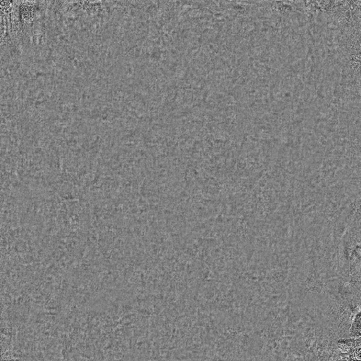</a><a href="media/wine_pixel_400.png">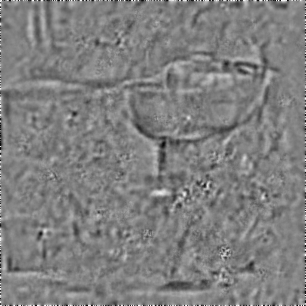</a><a href="media/wine_fft_1000.png">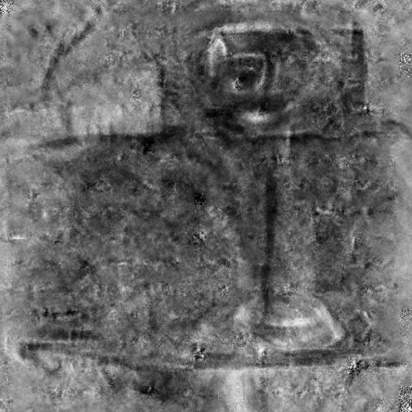</a><a href="media/wine_1000.png">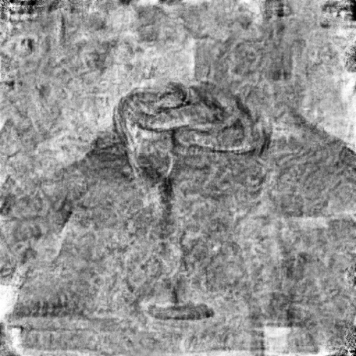</a>

| parameterization | description of the image at the end |
|---|---|
| pixels | "A blurry, grainy image of a person's face in the bottom right corner." |
| pixels, smoothed | "A close-up of a wine glass with a textured, grainy background." |
| Fourier | "A vintage, grainy image of a wine glass on a table." |
| multigrid | "A glass of wine on a table.", the target |

With plain pixels, the image remains gray with fine grain.
Smoothing and the Fourier parameterization give a recognizable glass,
but the model keeps describing the style of the image.
In longer runs of 5000 steps,
the image gave exactly the target
in 49 of the first 75 checks with multigrid
and in 2 of the first 105 checks with Fourier.

## Examples

**Different readings.**
In the first figure,
with multigrid noise and perturbation of the parameters,
the wine image gives the target in 16 of 41 checks, first at step 350,
with a large glass in front of the edge of a table.
The school bus is never reached:
the descriptions go through a skateboard, a lamp, a luggage rack, a wheelbarrow, and a wooden cart,
and end with "A black and white drawing of a chair on a rock."
The image shows a tall box on runners, an object with wheels but not a bus.
In the third image, the model sees a small black cat on a stand in the upper left
and reads the white blotches around it as snow:
"A black cat sitting on a wooden bench in a snowy, snowy landscape."

**A short target gives a minimal image.**
For "A cat sitting on a table.",
with multigrid noise, perturbation of the parameters,
and a small penalty on the total variation and the Laplacian of the image,
at steps 100, 150, 175, 225, and 1000:

<a href="media/cat_perturb_tv_100.png">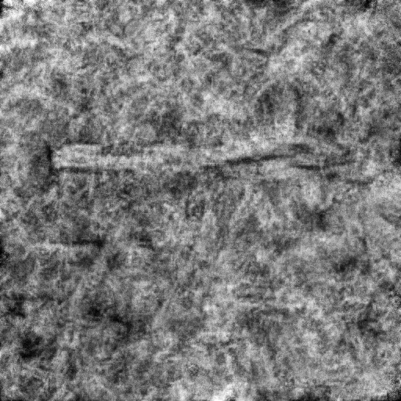</a><a href="media/cat_perturb_tv_150.png">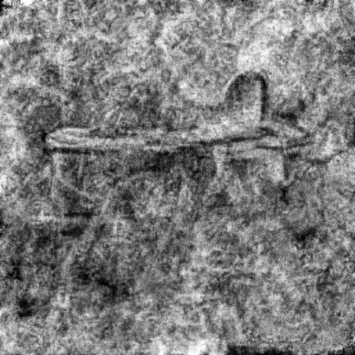</a><a href="media/cat_perturb_tv_175.png">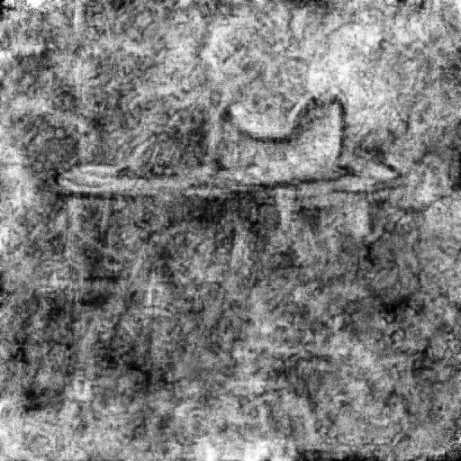</a><a href="media/cat_perturb_tv_225.png">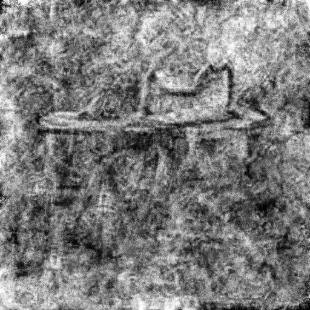</a>

| step | description |
|---|---|
| 100 | "A grainy, low-resolution photograph of a horizontal, dark object lying on a textured, light-colored surface." |
| 150 | "A blurry, grainy image of a table with a chair." |
| 175 | "A cat sits on a table in a grainy, low-resolution image." |
| 225 | "A cat sitting on a table." |

The table appears first, then the back of the cat, then the ears.
From step 225 on, the image gives exactly the target at every check (every 25 steps).
It is a line sketch that contains only what the sentence describes,
so the model has nothing else to mention.

**Evolution.**
With plain Gaussian noise and no perturbation,
the wine image at steps 100, 200, 300, 400, and 1000:

<a href="media/wine_100.png">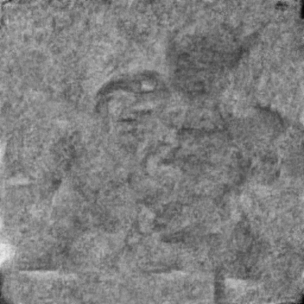</a><a href="media/wine_200.png">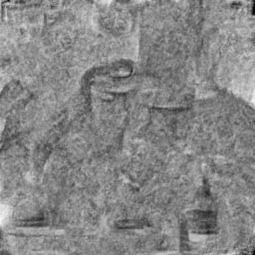</a><a href="media/wine_300.png">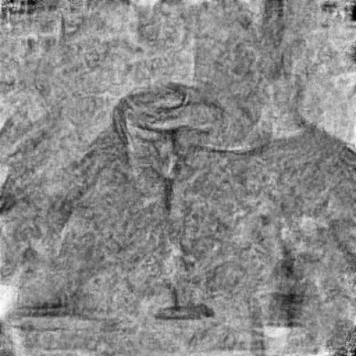</a><a href="media/wine_400.png">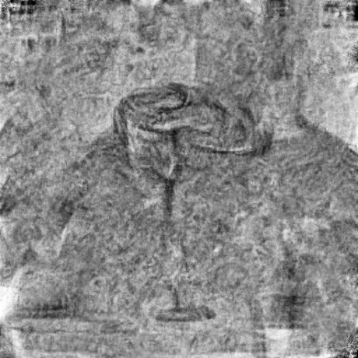</a>

| step | description |
|---|---|
| 50 | "This is a grayscale medical image, likely a CT scan or MRI, ..." |
| 100 | "A grainy, low-resolution image of a person's face, ..." |
| 200 | "A grainy, low-resolution image showing a table with several bottles and glasses." |
| 300 | "A grainy, low-resolution image of a person wearing a long-sleeved shirt with a wine glass on a table." |
| 400 | "A glass of wine on a table." |

A silhouette of a person appears first and is gradually replaced by the glass.

**Parts instead of a whole.**
Earlier runs with plain Gaussian noise and no perturbation,
for the wine, the school bus, and a long description of a cat:

<a href="media/schoolbus_1000.png">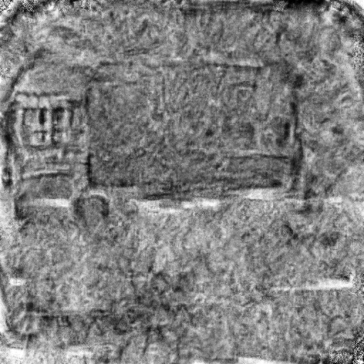</a><a href="media/cat_1000.png">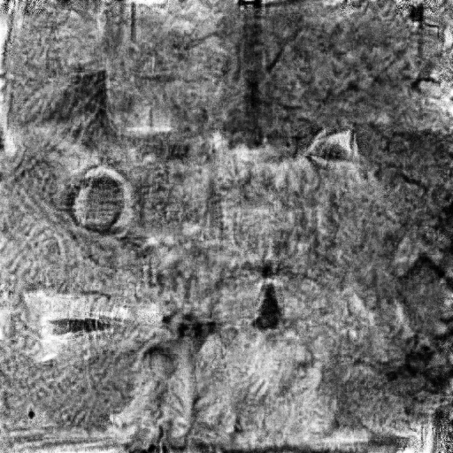</a>

The long target for the cat,
"A black and white photograph of a fluffy cat sitting on a windowsill,
looking straight at the camera with large round eyes, pointed ears, and long white whiskers.",
is not reached.
The image contains the named features, an eye, an ear, a nose, whiskers, and a window frame,
but they are scattered instead of forming one face,
and the model describes it as a cat "with its face mirrored across the center."

**A larger model.**
The wine target with Qwen3.5-2B:
0.8B (left), 2B (middle), and 2B in color (right):

<a href="media/wine_2b_1000.png">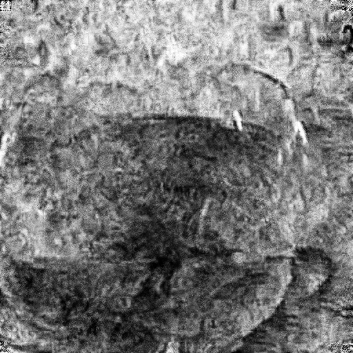</a><a href="media/wine_2b_color_1000.png">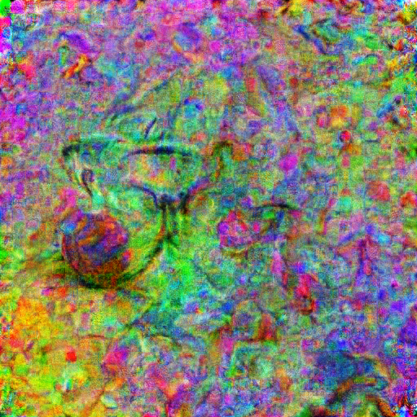</a>

In grayscale, the 2B model draws a close-up instead of a scene,
a dark bowl of liquid with a bright rim, but no stem or table,
and keeps describing the grain and style of the image.
In color, it first reads "glass" as eyeglasses,
"A pair of eyeglasses lies on a colorful, grainy, psychedelic background." at step 100,
and the image remains colorful noise with a small glass.
Neither run reaches the target.

## Open questions

- Larger models: the 2B model is harder to satisfy exactly,
  and its images differ in composition, not only in quality.
- Color: fine-grained color noise dominates in RGB.
  A luminance-chrominance parameterization with chrominance
  only on the coarse multigrid levels is a natural next step.
- Which of the noise, the perturbation, and the regularization
  makes the images coherent, and whether the images transfer between models.

The runs take a few minutes each, about 0.2 s per step on one consumer GPU.
